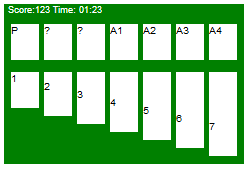
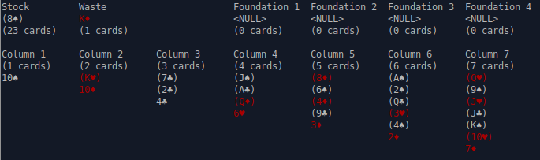

TODO:
- find out about more correct terms for the 'foundation', 'bottom', 'revealed cards'

# What's this about

Solitaire was the first computer game I have played, ages ago, on an ancient Windows 3.1 laptop. I have never actually implemented it. 

# The target platform

Let's target Gameboy Advance (GBA). It has a resolution of 240x160, capable of displaying 32,768 (15-bit) colors. The input our directional buttons on the d-pad, and A, B buttons and runs and ARM7 CPU at 6.78 MHz. The games are stored on cartridges containing the ROM with the code and data. 

In terms of capabilities it's like a hardware 2D engine, being able to display sprites at arbitrary locations, with hardware rotation and scaling, but also offering a bitmapped mode, sound generators, etc.

There is no operating system running on the GBA, it's just bare metal. To interface with the hardware we'll use memory-mapped IO - for example the bitmapped mode works this way - by setting bytes of memory after the address `0x06000000` to something, pixels get drawn on the screen.

We can develop in C using the excellent [devkitPro toolchain](https://devkitpro.org/). 

## Graphics

The Game Boy Advance has a couple of graphic modes. I plan either to use [Mode 3](https://www.coranac.com/tonc/text/bitmaps.htm), which is a bitmapped mode, with a resolution of 240x160 and a 16-bit palette of 16 colors. Or jump into the hardware accelerated graphics mode, which deals with sprites, tiles and background.

A tile is an 8x8 pixel bitmap. It can have 4bpp or 8bpp colors, the latter obviously requiring more memory (64 bytes vs 32 bytes) A sprite is composed of multiple tiles. Tiles are stored in charblocks. A charblock has a size of 16 kb, so there's a room for 512 (or 256) tiles.

This implies we'll have to convert our graphics into 8x8 tiles, and also implies that the game objects (such as cards) should be sized in multiples of 8 pixels as well.

# Prototyping the dimensions

We'd like a screen layout such as:

Score Time 
P C   F F F F

1 2 3 4 5 6 7

Where the P/C stands for pile and the card next to it; F is the foundation placeholder. The numbers 1,2,3,4,5,6,7 represent the columns with their respective initial height.

So we need 7 columns of cards organized 2 rows. we also need some padding for the board and cards

## Let's prototype in HTML / CSS

I considered multiple options on how to prototype - whethe to do it in Creating a simple mock board in HTML :

```html
   <div id="board">
        <div class="row">
            <div id="pile" class="card">P</div>
            <div class="card">?</div>
            <div class="card" id="blank">?</div>
            <div class="card" id="f1">A1</div>
            <div class="card" id="f2">A2</div>
            <div class="card" id="f3">A3</div>
            <div class="card" id="f4">A4</div>
        </div>
        <div class="row second-row">
            <div class="card column-1" id="p1">1</div>
            <div class="card column-2" id="p2">2</div>
            <div class="card column-3" id="p3">3</div>
            <div class="card column-4" id="p4">4</div>
            <div class="card column-5" id="p5">5</div>
            <div class="card column-6" id="p6">6</div>
            <div class="card column-7" id="p7">7</div>
        </div>
    </div>
```

We can define the basic styles in CSS and tweak the numbers as we go.

Having Screen and Board entities lets us set up the board - using GBA 240x160px dimensions for screen and padding to make space for the score row:

```css
#screen{
    width:240px;
    height: 160px;
    background-color: green;
}

#board {
    padding-top: 20px;
    padding-left: 2px;
}
```

The we can define a card class, and by twiddling the numbers I've arrived at the following dimensions: 28x36 for the card, 5 px for the margin, so the card itself is 23x36px.

```css
.card {
    width: 28px;
    height: 36px;
    margin-left: 5px;
    float: left;
    background-color: white;
}
```

Now to simulate the height part of the layout let's define the column-N class, where the N is the height of the column in cards (column-5 starts with 4 hidden cards and 1 revealed card).

Using multiples of 8px scales nicely

```css

.column-2 {
    padding-top: 8px;
}

.column-3 {
    padding-top: 16px;
}
...
```

Keeping score

The score row should probably include the score and a timer.

Mocking it up as another div (above the board)

```html
<div id="score-row">Score:123   Time: 01:23</div>
```

and styling with `position:absolute` so not to move the other elements:

```css
#score-row{
    position: absolute;
    margin-left: 4px;
    font-size: xx-small;
    color:white;
}
```

This is how it looks so far:



# Implementing Solitaire

Let's start by defining the cards and some relations.
There are four suits: 
- ♥ Heart 
- ♠ Spade
- ♣ Club
- ♦ Diamond

There are also the ranks (ascending)

- A, 2, 3, 4, 5, 6, 7, 8, 9, 10, J, Q, K

Hence the card structure can be defined in C as: 
```c
enum {
	SUIT_HEART, SUIT_SPADE, SUIT_CLUB, SUIT_DIAMOND // ♥♠♣♦
} ;

enum {
	RANK_A, RANK_2, RANK_3, RANK_4, RANK_5, RANK_6, RANK_7, RANK_8, RANK_9, RANK_10, RANK_J, RANK_Q, RANK_K
};

typedef struct card {
	int suit;
	int rank;
};
```

## Rules as function

Solitaire defines a couple of card interactions, which we'll define as functions:
- is ace? (can be placed on top of a blank pile)
- is red? 
- is black?
- are alternate colors? (as card colors in columns must alternate between red and black)
- is in sequence? (A -> 2 -> 3 ... -> K)
- can be placed on foundation? (A♥ -> 2♥ -> 3♥ -> K♥)
- can be placed on bottom? (is alternate and is in sequence) ( J♦ -> 10♠ -> 9♥ -> 8♣ -> 7♥)

Can be implemented as a set of simple C functions:
```c
int is_black(card c) {
	return c.suit == SUIT_CLUB || c.suit == SUIT_SPADE;
}

int is_red(card c) {
	return c.suit == SUIT_HEART || c.suit == SUIT_DIAMOND;
}

int is_ace(card c) {
	return c.rank == RANK_A;
}

int is_alternate_color(card first, card second) {
	return is_black(first) != is_black(second);
}

int is_in_sequence(card lower, card higher) {
	return higher.rank == lower.rank + 1;
}

int can_be_placed_bottom(card parent, card child) {
	return is_alternate_color(parent, child) && is_in_sequence(child, parent);
}

int is_same_suit(card first, card second) {
	return first.suit == second.suit;
}

int can_be_placed_on_foundation(card parent, card child) {
	return is_same_suit(parent, child) && is_in_sequence(parent, child);
}
```

This also can be tested during the development with a simple "test":

```c
    card c5S = make_card(SUIT_SPADE, RANK_5);
	card c6H = make_card(SUIT_HEART, RANK_6);
	printf("5s is black %d vs 1 \n", is_black(c5S));
	printf("5s is red %d vs 0 \n", is_red(c5S));
    printf("5s 6h is alternate %d vs 1 \n", is_alternate_color(c5S, c6H));
    ...
```

We can also implement more Solitaire rules and also start representing the game state.

### Game deck

Let's define our first pile of cards - the deck of initial 52 cards.

```c
#define CARD_COUNT 52

typedef struct deck {
	int num_cards;
	card** cards;
} deck;

deck* make_deck() {
	deck* deck = mallocz(sizeof(deck));
	deck->cards = mallocz(sizeof(card*) * CARD_COUNT);
	deck->num_cards = 0;
	for (int rank = 0; rank < RANK_COUNT; rank++) {
		for (int suit = 0; suit < SUIT_COUNT; suit++) {
			deck->cards[deck->num_cards++] = make_card_ptr(suit,rank);
		}
	}
	return deck;
}
```

It seems there are a couple more piles around Solitaire - for example, the reveled cards, the stacks of cards on the foundation, and the piles on the bottom. Seems like it would be nice to have the concept of the pile encapsulated as a structure with associated functions.

```c
typedef struct pile {
	int num_cards;
	card** cards;
} pile;

pile* make_pile();
void append(pile* pile, card* card);
card* pop(pile* pile);
card* dequeue(pile* pile);
card* peek_card_at(pile* pile, int index);
```

### Array vs linked list

We have either the option of using a linked list to represent the collection of cards in a pile, or just assume there will never be a larger pile than 52 and go with an array as the backing store and a counter. With this, at the expense of more memory overhead per pile. As there is a known number of piles: unturned and turned card deck, 4 foundations, 7 columns, the total is 2+4+7=13 piles. On a 32-bit system, that's at most `13 * (sizeof card*) * CARD_COUNT = 13 * 4 * 52 = 2704` bytes overhead. Meh.

On the other hand, linked lists are a kind of a traditional C structure, so it may also take us there. Let's see.

## Prototyping without graphics

It might not actually be such a bad idea to implement a commandline solitaire first, then do a graphical interface on top later.

### Ncurses

There's a fine text-user interface library ncurses (new curses) out there. If the unicode version `ncursesw` is used, it also supports unicode card symbols, such as ♥♠♣♦. That enables us to represent the cards as a fairly human-readable 10♠ or J♥.

We can introduce helper functions such as `rank_to_charptr` and `suit_to_charptr` that we'll later use to print a card:

```c
const char *suit_to_charptr(int suit) {
  switch (suit) {
  case SUIT_HEART:
    return "\u2665";
  case SUIT_SPADE:
    return "\u2660";
  case SUIT_CLUB:
    return "\u2663";
  case SUIT_DIAMOND:
    return "\u2666";
  ...
  }
}
```

Printing a card on the screen is done with the `printw` ncurses function, which behaves like `printf`. We can also move the cursor around with the `move(int row, int column)` function.

```c
void printw_card(card *c) {
  printw("%s%s", rank_to_charptr(c->rank), suit_to_charptr(c->suit));
}
```

### Basic layout

So far we got to the point of having the text user interface laid out:

Here I also had to decide how the cards in the piles would be ordered. I think it makes sense that the first card would mostly be the displayed one - for stock, waste and fodation piles.

I needed to add a `peek(pile *pile)` function to peek at the pile, as these piles would only display the top card.

The column piles would be ordered 'top to bottom', so initially only the last card would be revealed, but we can draw the column from first card to the last.

The rendering code is fairly uninteresting, using string arrays for headers, picking an arbitrary size (100) for the game deck terminal width, then iterating through the piles and moving the cursor around the screen.

```c
char *first_row_headers[] = {"Stock",        "Waste",        "",
                             "Foundation 1", "Foundation 2", "Foundation 3",
                             "Foundation 4"};
...
// first row headers
int column_size = 14;
for (int i = 0; i < 7; i++) {
move(0, column_size * i);
  printw("%s", first_row_headers[i]);
}
// first row content 
move(1, 0);
printw_card(peek(stock(state)));
move(2, 0);
printw_pile_size(stock(state));
...
 // foundations
for (int f = 0; f < FOUNDATION_COUNT; f++) {
  int foundation_1_column = 3;
  move(1, (foundation_1_column + f) * column_size);
  printw_card(peek(foundation(state, f)));
  move(2, (foundation_1_column + f) * column_size);
  printw_pile_size(foundation(state, f));
}

```

At this point of development it makes sense to also show the face-down cards, represented as (Q♦). I had to add the revealed flag (face up), as it's possible to have a sequence of multiple face up cards in the columns.

So we end up with a representation such as:

```
Column 4 
(4 cards)
(J♠) 
(A♣)  
(Q♦)   
6♥      
```

### Adding color to curses

If we add a bit of color, the player will have have an easier time distinguishing 4♣ and 4♥ (four of spades and four of hearts). Ncurses supports colors in the terminal. I've used a [tutorial by Jim Hall](https://www.linuxjournal.com/content/programming-color-ncurses) to get up to speed with the basics.

There are only eight basic colors supported by the console - black, red, green, yellow, blue, magenta, cyan, white. Then we have to define a color pair with `init_pair(index, foreground, background)`. You can also pass `-1` as a color this function to use the default value.

Let's just change the foreground color of the red cards:

```c
#define BLACK_PAIR 1
#define RED_PAIR 2
...
init_pair(BLACK_PAIR, -1, -1);
init_pair(RED_PAIR, COLOR_RED, -1);
...
attron(COLOR_PAIR(RED_PAIR));
printw("4\u2660); //4♠
attroff(COLOR_PAIR(RED_PAIR));
```

To actually use that color pair during printing, use `attron(COLOR_PAIR(int pair))` to turn on the color attribute. This should be later turned off by a corresponding `attroff()` call.



### Controls

We have the option of using text-based controls, that would (in case of moving the cards) have a form of `source destination`, so for example `c3 c4` means take 1 card from column 3 and put it at column 4. We also need to draw a card from the stock, so that could be a command `s`. To move the drawn card (from the waste), we'll use `w`. As we sometimes need to move more than one card, it could be solved with a command like `3c1 c5` - take three cards from column 1 and put them at column 5.

So we have a couple of possible combinations:

```
s
c3 f1
c7 c2
3c4 c5
w c4
w f3
```

There are some things, that should not be possible. Moving multiple cards from a column to a foundation makes no sense, as they won't be ordered in ascending order of the same suit. Moving multiple cards from the waste into a column can be disallowed as well. Drawing multiple cards from the stock might be possible, but let's ignore it and add it later. Let's also prohibit moving cards from foundations elsewhere.

We have multiple options on how to parse the user input in C. I initially thought of parsing it by hand going character by character and keeping track of state or using the `scanf` function with multiple input templates, such as `%c%d %c%d` for the likes of `c3 f1`. The `scanf` family of functions returns the number of specific conversions, so we can check the return value for success and cascade the checks.

With the first option one should prepare the templates from the most specific to the least specific, we end up with four specific patterns:

```
%dc%d c%d -> 3c4 c5
%dc %c%d -> c3 f1 / c7 c2
w %c%d -> w c4 / w f3
s -> s
```

As the parsing function `parsed_input parse_input(char *command)` should return multiple values, let's wrap it in a structure:

```c
typedef struct parsed_input {
  char source;
  char destination;
  int source_index;
  int destination_index;
  int source_amount;
  int success;
} parsed_input;
```

And the parsing function is trying the patterns one by one, filling in the sources/destinations, if they are known.

```c
parsed_input parse_input(char *command){
  parsed_input parsed;
  parsed.success = 1;
  parsed.source_amount = 1;
  // parser patterns 
  char *pattern_multi_move = "%dc%d c%d";
  char *pattern_single_move = "c%d %c%d";
  char *pattern_waste_move = "w %c%d";
  char *pattern_stock = "s";
  if(sscanf(command, pattern_multi_move, &parsed.source_amount, &parsed.source_index, &parsed.destination_index) == 3){
    parsed.source = 'c';
    parsed.destination = 'c';
  }
  else if(sscanf(command, pattern_single_move, &parsed.source_index, &parsed.destination, &parsed.destination_index) == 3){
    parsed.source = 'c';
  }
  else if(sscanf(command, pattern_waste_move, &parsed.destination, &parsed.destination_index) == 2){
    parsed.source = 'w';
  }
  else if(strcmp(command, pattern_stock) == 0){
    parsed.source = 's';
  }
  else{
    parsed.success = 0;
  }
  return parsed;
}

```


Later as a graphical interface is developed we also can have a concept of a cursor that we can move across the piles with the arrow keys.

### Adding more gameplay logic

### 

# The Gameboy port

# Graphics

There is no graphics library. The video RAM is mapped at the address `0x06000000`

We can draw things into the video memory ourselves (set a pixel to a palette color):

```c
#define MEM_VRAM 0x06000000
#define vid_mem ((u16 *)MEM_VRAM)

inline void draw_point(int x, int y, int clr)
{
    vid_mem[y * SCREEN_WIDTH + x] = clr;
};
```

## Sprites

!TODO sprites

## Palette

!TODO update to solitaire

To obtain this palette, Python script helped convert 32-bit hexcodes into 16-bit:

```python
palette = ["#000000", "#ffffff", "#880000", "#aaffee",
      "#cc44cc", "#00cc55", "#0000aa", "#eeee77",
      "#dd8855", "#664400", "#ff7777", "#333333",
      "#777777", "#aaff66", "#0088ff", "#bbbbbb"]

i = 0
for r,g,b in [(int(color[1:3],16), int(color[3:5],16), int (color[5:7],16)) for color in palette]:
    gba_color = (((r >> 3) & 31) | (((g >> 3) & 31) << 5) | (((b >> 3) & 31) << 10))
    print(f'palette[{i}] = {hex(gba_color)};')
    i = i+1
```


## Input

To read the keys one should call `scanKeys();` to obtain the keypad state and then call the `keysDown()` function to get the keys that have been pressed, as documented in devkitPro [`gba_input.h`](https://github.com/devkitPro/libgba/blob/master/include/gba_input.h). 

We'll need the following keys:

```c
typedef enum KEYPAD_BITS {
	KEY_A		=	(1<<0),	/*!< keypad A button */
	KEY_B		=	(1<<1),	/*!< keypad B button */
	KEY_SELECT	=	(1<<2),	/*!< keypad SELECT button */
	KEY_START	=	(1<<3),	/*!< keypad START button */
	KEY_RIGHT	=	(1<<4),	/*!< dpad RIGHT */
	KEY_LEFT	=	(1<<5),	/*!< dpad LEFT */
	KEY_UP		=	(1<<6),	/*!< dpad UP */
	KEY_DOWN	=	(1<<7),	/*!< dpad DOWN */
	KEY_R		=	(1<<8),	/*!< Right shoulder button */
	KEY_L		=	(1<<9),	/*!< Left shoulder button */

	KEYIRQ_ENABLE	=	(1<<14),	/*!< Enable keypad interrupt */
	KEYIRQ_OR		=	(0<<15),	/*!< interrupt logical OR mode */
	KEYIRQ_AND		=	(1<<15),	/*!< interrupt logical AND mode */
	DPAD 		=	(KEY_UP | KEY_DOWN | KEY_LEFT | KEY_RIGHT) /*!< mask all dpad buttons */
} KEYPAD_BITS;
```

# Next target
M5Stick C
80x160 LCD

Here we have to drastically reduce card and board size (80x160).
As M5Stick has only three buttons, we probably need to use and alternate control method. 
Using the accelerometer to tap the stick from the left/right/top/bottom side we could move the cursor and use the big M5 button as the selector.